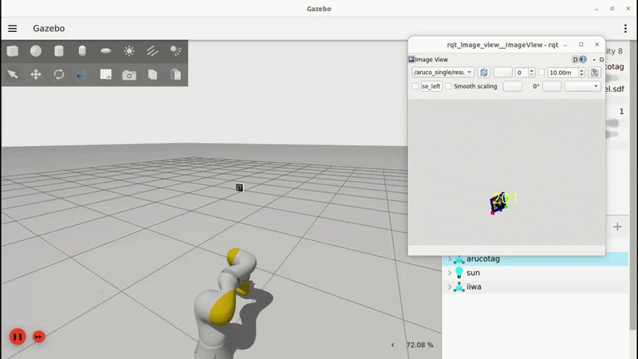
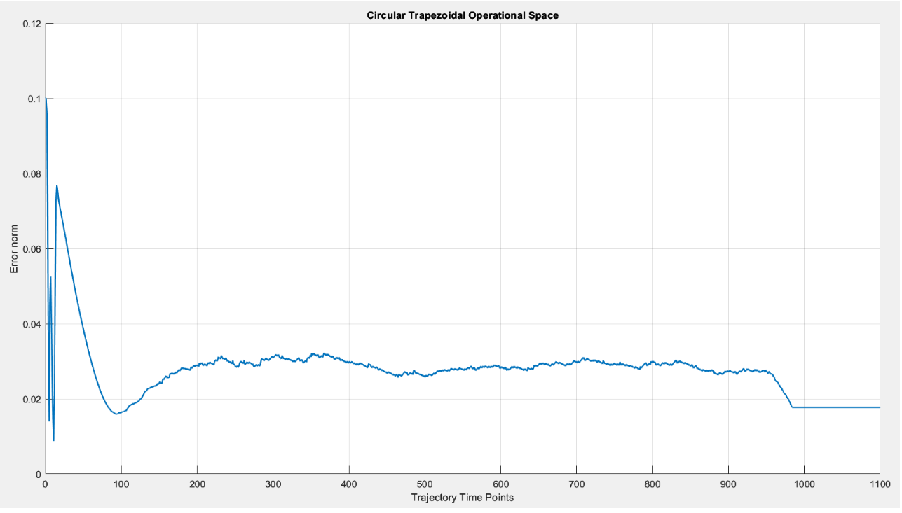
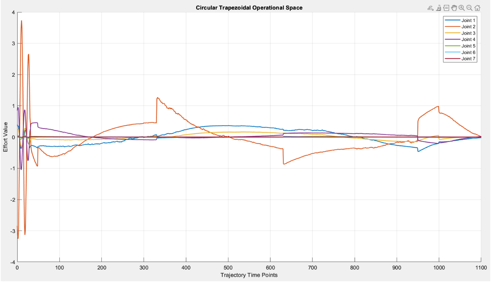

# ROS2 Vision-Based Control for KUKA iiwa

This repository implements a modular perception and control pipeline for the **KUKA LBR iiwa** (7-DOF) manipulator within the **ROS2** ecosystem. The project demonstrates advanced robotics concepts including **Visual Servoing**, **Redundancy Resolution** via Null-Space projection, and **Dynamic Torque Control**.

## 🚀 Key Features

* **Modular Perception Engine**: Real-time 6-DOF pose estimation using **ArUco markers**. The architecture is decoupled, allowing easy integration with other vision-based estimators (e.g., AI-based object detection).
* **Visual Servoing (Look-at-point)**: Precision alignment of the end-effector camera axis with a dynamic target using the **Camera Jacobian**.
* **Redundancy Resolution**: Exploitation of the robot's 7th degree of freedom ($N\dot{q}_{0}$) to perform secondary tasks—such as following Cartesian trajectories—without compromising the primary vision task.
* **Multi-Interface Control**:
    * **Kinematic Control**: Velocity-based positioning and tracking.
    * **Dynamic Control**: Effort-based (Torque) control in both Joint and Operational space using the **KDL library**.
* **Robustness**: Implemented custom logic to mitigate "shaking" effects caused by detection noise in Gazebo Ignition by monitoring error norms.

## 🛠 Tech Stack
* **Framework**: ROS2 (Humble)
* **Simulation**: Gazebo Ignition
* **Libraries**: KDL (Kinematics and Dynamics), OpenCV, Eigen, TF2.

## 🏗 Modular Architecture
The system is split into two main layers to ensure flexibility:
1.  **Vision Node**: Processes the camera feed, detects ArUco markers, and publishes the target transformation.
2.  **Control Node**: Subscribes to the target pose and computes the necessary joint velocities or efforts based on the selected control law.

## 💻 Installation & Usage

### Setup
```bash
# Clone the repository into your ros2_ws/src
# From ros2_ws
source ./src/setup.sh
```

## Launching the Simulation
To start Gazebo with the KUKA iiwa and the ArUco environment:

```bash
# For Velocity Interface
ros2 launch ros2_kdl_package my_aruco_gazebo.launch.py

# For Effort (Torque) Interface
ros2 launch ros2_kdl_package my_aruco_gazebo.launch.py command_interface:="effort" robot_controller:="effort_controller"
```

## Running the Control Node
The node supports various parameters to switch between tasks and controllers:
```bash
ros2 run ros2_kdl_package ros2_kdl_node --ros-args \
  -p cmd_interface:=effort \
  -p task:=look_at_point \
  -p traj_type:=cir_trap \
  -p q0_task:=exploit \
  -p cont_type:=op
```

## 📈 Performance & Results

### System Demo

*The video above demonstrates the KUKA iiwa performing a circular trajectory while maintaining the ArUco marker at the center of the camera frame using the Look-at-point controller.*

### Trajectory Analysis
The control pipeline was validated through intensive testing with different trajectory profiles. Below are the results for the **Circular Trapezoidal** trajectory under **Operational Space Effort Control**.

| Task Error Norm | Joint Efforts |
|:---:|:---:|
|  |  |

* **Precision Analysis**: The error norm shows an initial oscillatory phase due to the convergence of the Look-at-point task from the starting configuration. During the motion, the error stabilizes around a non-zero mean (~0.03), which is attributed to the limited resolution of the vision sensor and the intrinsic noise of the ArUco detection in the simulated environment.
* **Stability & Dynamics**: The effort evolution  reveals high-frequency oscillations during the initial phase and sharp peaks at the trajectory's blend points (accel/decel transitions). 
* **Critical Analysis**: These spikes suggest a high sensitivity to the trapezoidal acceleration profiles and potential "chattering" due to the aggressive gains required for precise visual tracking. In a real-world deployment, these would be mitigated through further gain tuning or the implementation of smoother (e.g., S-curve) trajectories to protect the hardware.

### Challenges & Solutions: Anti-Shaking Logic
* **Challenge**: Real-time vision sensors in Gazebo can introduce high-frequency noise, which translates into joint "jitter" or shaking when the robot is near the target.
* **Solution**: I implemented a software-level deadband. The control node only updates the target transformation if the change in position is $>0.01m$ or the change in orientation is $>0.1rad$. This logic ensures a rock-solid steady state without compromising tracking reactivity.

## 📂 Repository Structure
* **iiwa_description**: URDF/Xacro files, including the camera sensor integration on the end-effector.
* **ros2_kdl_package**: Core control nodes implementing KDL-based solvers and vision-based control laws.
* **ros2_opencv**: Vision processing node for target detection.
